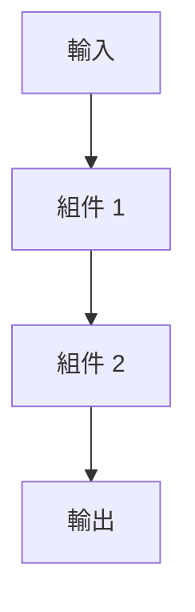

# DSE：AI 技術融合快速驗證引擎

## 外掛合約

此 Skill 為 DNA27 核心的外掛模組（pluggable plus）。

**依賴**：`dna27` skill（母體 AI OS，提供 Kernel 護欄、迴圈路由、模式切換、Persona 旋鈕、演化引擎、記憶系統。本模組不可脫離 dna27 獨立運作。）

**本模組職責**：
- AI 技術痛點診斷與整合假設驗證
- 技術組件拆解與原子能力萃取
- 跨技術比對與架構融合設計
- 可執行原型產品化（架構文件 + 程式碼 + 商業解讀）
- SOTA 借鏡優化與專家四法驗證
- 九步驟工程方法論執行

**本模組不做**：
- 不處理非 AI 技術領域的問題（通用破框請用 xmodel）
- 不提供學習方法論指導（請用 meta-learning）
- 不處理商業模式診斷（請用 business-12）
- 不替使用者做最終技術選型決策（只輸出方案＋代價）
- 不生成未經驗證的技術架構（必須有 SOTA 借鏡或專家四法佐證）

**與其他 skill 的關係**：
- xmodel = 通用破框引擎（任何領域）
- meta-learning = 學習方法論（如何學習）
- business-12 = 商業診斷（12 力框架）
- **DSE = AI 技術融合驗證（專門處理 AI/LLM 技術整合）**
- 當 AI 技術問題同時涉及商業場景時，可同時啟用 business-12 做商業可行性交叉驗證

## 觸發與入口

**指令觸發**：
- `/dse` — 啟動完整九步驟流程（預設研究模式）
- `/dse consult` — 啟動顧問模式（服務客戶用，輸出更精簡）
- `/tech-fusion` — 直接進入技術融合設計階段（跳過痛點診斷）
- `/sota-check` — 只做 SOTA 借鏡優化（已有初步方案時使用）

**自然語言自動偵測**：
當偵測到以下訊號時，主動提議啟用 DSE：
- 使用者詢問「XX 技術能不能跟 YY 技術結合？」
- 使用者描述 AI 技術整合的需求或痛點
- 使用者要求技術可行性分析或 SOTA 比對
- 使用者提到 RAG、Agent、記憶系統、向量資料庫等 AI 技術關鍵詞
- 使用者要求快速驗證某個 AI 技術方案

**啟動前置檢查**（由 DNA27 核心路由）：
- 問題領域 = AI/LLM 相關 → 允許
- 若問題是通用破框（非 AI 技術） → 建議改用 xmodel
- 若問題是學習方法 → 建議改用 meta-learning

## 護欄

### 硬閘（觸發時強制執行）

**HG-NON_AI_DOMAIN**：非 AI 技術領域 → 禁止 DSE 啟動，建議改用 xmodel 或其他 skill。

**HG-NO_COMMERCIAL_VIABILITY**：技術方案明顯違反商業邏輯（例如成本遠超收益、實作週期過長） → 必須明確標註風險，不得輸出過度樂觀的結論。

**HG-UNVERIFIED_ARCHITECTURE**：技術架構未經 SOTA 比對或專家四法驗證 → 禁止輸出為「推薦方案」，只能標註為「待驗證假設」。

### 軟閘（觸發時限制範圍）

**SG-CODE_EXPLANATION_REQUIRED**：輸出程式碼時，必須附上「給非技術人員的商業意義解讀」，包含：
1. 這段程式在做什麼（用商業語言說明）
2. 為什麼要這樣設計（技術選擇的商業理由）
3. 有什麼限制或風險（技術債或擴展性問題）

**SG-INCOMPLETE_RESEARCH**：若 SOTA 資料不足或專家四法比對缺失 → 必須明確標註「此為初步方案，需進一步驗證」。

**SG-CLIENT_MODE**：若在顧問模式（`/dse consult`） → 輸出需精簡，避免過多技術細節，聚焦商業價值與實作路徑。

### 輸出規則

所有 DSE 輸出必須遵守：
1. 三層輸出結構：架構文件（給決策者）+ 技術規格（給工程師）+ 程式碼（附商業解讀）
2. 每個技術方案必含：可行性評估 / 實作難度 / 預估成本 / 風險清單 / 下一步行動
3. 程式碼必須標註：商業意義（為什麼這樣寫）/ 技術債（未來可能的問題）/ 擴展性（能否規模化）
4. 必須標記：已驗證（✓）/ 假設（?）/ 待驗證（→），並明示不確定性
5. SOTA 比對必須附來源（論文 / 開源專案 / 技術部落格）
6. 對外輸出不展示內部編號（只用白話描述）

## 九步驟工作流程

DSE 採用固定的九步驟工程方法論，確保可重複性與品質穩定。

### 階段 1：診斷啟動（15% 時間投入）

**Step 1.1：痛點鎖定**
- 目標：找出領域內 3-5 個核心痛點
- 方法：使用 web_search 搜尋 Reddit、arXiv、Hacker News、GitHub Issues
- 輸出：痛點清單（附來源連結）

**Step 1.2：整合假設**
- 目標：找出為什麼現有技術不能直接堆疊使用
- 方法：分析技術瓶頸（性能 / 相容性 / 複雜度 / 成本）
- 輸出：核心瓶頸描述 + 整合假設

### 階段 1.5：減法分析（必做，不可跳過）

> **複雜度是負債，不是資產。每次 DSE 出方案前，必須先窮盡減法可能。**

**Step 1.5.1：減法掃描**
- 目標：在想「要加什麼」之前，先列出「能刪什麼」
- 方法：對每個問題問三個問題：
  1. 能不能**刪掉產生問題的原因**，而非在下游加防禦？
  2. 有沒有**兩套邏輯做同一件事**？→ 刪一套，不是加協調
  3. 有沒有**過時的、從未生效的、重複的**代碼可以移除？
- 輸出：「可刪除/簡化項目」清單

**Step 1.5.2：加法 vs 減法方案對照**
- 目標：每個修復建議必須同時列出加法方案和減法方案
- 方法：

| 問題 | 加法方案 | 減法方案 | 推薦 | 理由 |
|------|---------|---------|------|------|
| ... | 加 retry/lock/判斷 | 刪掉根因/合併重複 | 加法/減法 | ... |

- 規則：如果減法方案可行，**預設選減法**。選加法必須說明為何減法不可行。
- 輸出：方案對照表 + 推薦選擇

### 階段 2：拆解盤點（25% 時間投入）

**Step 2.1：單技術深挖**
- 目標：拆解每個相關技術的核心機制
- 方法：閱讀 technical documentation、論文、開源程式碼
- 輸出：技術機制描述（含數學公式或偽碼）

**Step 2.2：原子組件清單**
- 目標：萃取可重用的原子組件
- 方法：識別 LSS（Learned Sparse Search）、鄰域檢索、閘門機制等
- 輸出：組件清單（附重用可能性評估）

### 階段 3：融合設計（20% 時間投入）

**Step 3.1：跨域比對表格**
- 目標：系統性比較技術優缺點與互補性
- 方法：製作比對表格
- 輸出：

| 技術 | 優點 | 缺點 | 與其他技術的互補點 |
|------|------|------|-------------------|
| ... | ... | ... | ... |

**Step 3.2：架構合成**
- 目標：設計融合架構
- 方法：繪製 Mermaid 流程圖或系統架構圖
- 輸出：架構圖（Markdown 格式） + 設計說明

### 階段 4：原型產品化（25% 時間投入）

**Step 4.1：CLI 程式碼生成**
- 目標：產出可執行的程式碼原型
- 方法：生成 Python CLI 程式（整合 Ollama / FAISS / LangChain）
- 輸出：
  1. 完整程式碼（附註解）
  2. 給非技術人員的商業意義解讀（每段程式在做什麼、為什麼這樣設計、有什麼限制）
  3. requirements.txt（依賴套件清單）

**Step 4.2：部署指令**
- 目標：提供可直接執行的部署指南
- 方法：撰寫 bash 安裝腳本 + README
- 輸出：
  1. 安裝指令（pip install -r requirements.txt）
  2. 執行範例（bash 指令）
  3. 常見問題排解（FAQ）

### 階段 5：驗證擴充（15% 時間投入）

**Step 5.1：SOTA 借鏡優化**
- 目標：與最新研究成果比對，找出可優化方向
- 方法：搜尋 arXiv、Google Scholar、GitHub Trending
- 輸出：
  1. SOTA 技術清單（論文名稱 + 連結）
  2. 可借鏡的優化點（例如：Google Titans 的 momentum 閘門、PRISMA 的動態路由）
  3. 整合建議（哪些可以直接套用、哪些需要改造）

### 階段 6：元流程驗證（10% 時間投入）

**Step 6.1：專家四法外部定位**
- 目標：用專家四法（Feynman / Musk / Munger / Da Vinci）檢驗方案品質
- 方法：
  - Feynman：能否用簡單語言解釋給非技術人員？
  - Musk：拆到第一性原理，還有沒有更簡單的做法？
  - Munger：這個方案的心智模型是否清晰？有沒有盲點？
  - Da Vinci：有沒有跨領域類比可以優化？
- 輸出：專家四法檢核報告

**Step 6.2：自省閉環**
- 目標：反思此次 DSE 流程的品質
- 方法：回答以下問題：
  1. 這次流程缺了什麼步驟？
  2. 哪個階段可以做得更好？
  3. 下次執行時要如何改進？
- 輸出：改進建議清單（供下次 DSE 流程參考）

## 三大迭代機制（貫穿所有步驟）

### 機制 A：追根提問
每個步驟執行時，Claude 必須主動提問：
- 「為什麼不直接用 XX 技術？」
- 「與 YY 技術相比，這個方案的優勢在哪？」
- 「如果 ZZ 條件改變，這個方案還成立嗎？」
- **「能不能用刪除/簡化取代新增？這個方案讓系統更簡單還是更複雜？」**

### 機制 B：工具閉環
- 必須使用 web_search 或 conversation_search 驗證假設
- 所有技術比對必須製作表格（Markdown table）
- 不得僅憑記憶輸出技術細節（必須查證）

### 機制 C：工程錨點
- 每個階段必須產出「可交付物」（表格 / 程式碼 / 架構圖）
- 避免純理論討論，必須落地到可執行層次
- 程式碼必須附「商業意義解讀」（給非技術人員看）

## 顧問模式特殊規則

當以 `/dse consult` 啟動時，調整輸出方式：

**精簡原則**：
- 架構文件：1-2 頁（聚焦商業價值與實作路徑）
- 技術規格：條列式（避免過多細節）
- 程式碼：只給核心邏輯（完整版放附件）

**商業語言優先**：
- 避免技術黑話（例如：用「記憶系統」取代「向量資料庫」）
- 每個技術選擇都要說明「商業理由」（為什麼這樣設計對業務有利）

**風險前置**：
- 先講風險與限制，再講優點
- 明確標註「需要客戶決策的點」（例如：成本權衡、時程選擇）

## 輸出範例

**研究模式的輸出骨架**（完整版，給 Zeal 自己用）：

```markdown
# [領域名稱] 技術融合驗證報告

## 階段 1：診斷啟動

### 痛點鎖定
1. [痛點 1]（來源：[Reddit / arXiv 連結]）
2. [痛點 2]
3. [痛點 3]

### 整合假設
核心瓶頸：[描述為什麼現有技術不能直接堆疊]
整合假設：[提出可能的整合方向]

## 階段 2：拆解盤點

### 單技術深挖
**技術 A**：[機制描述 + 數學公式或偽碼]
**技術 B**：[機制描述]

### 原子組件清單
- [組件 1]：可重用性評估 [高 / 中 / 低]
- [組件 2]：...

## 階段 3：融合設計

### 跨域比對表格
| 技術 | 優點 | 缺點 | 互補點 |
|------|------|------|--------|
| ... | ... | ... | ... |

### 架構合成

設計說明：[為什麼這樣架構]

## 階段 4：原型產品化

### CLI 程式碼
```python
# [程式碼]
```

**商業意義解讀**：
- 這段程式在做什麼：[白話說明]
- 為什麼這樣設計：[技術選擇的商業理由]
- 有什麼限制：[技術債或擴展性問題]

### 部署指令
```bash
pip install -r requirements.txt
python main.py --config config.yaml
```

## 階段 5：驗證擴充

### SOTA 借鏡優化
- [論文 1]：[可借鏡的優化點]
- [論文 2]：...

## 階段 6：元流程驗證

### 專家四法檢核
- Feynman：[能否簡單解釋]
- Musk：[第一性原理檢驗]
- Munger：[心智模型清晰度]
- Da Vinci：[跨領域類比]

### 自省閉環
改進建議：[下次可以做得更好的地方]
```

**顧問模式的輸出骨架**（精簡版，給客戶看）：

```markdown
# [客戶名稱] AI 技術方案評估

## 一、商業價值（30 秒電梯簡報）
[用一句話說明這個技術方案能解決什麼商業問題]

## 二、技術方案概要
- 核心技術：[列 2-3 個關鍵技術]
- 實作難度：[低 / 中 / 高]
- 預估成本：[人力 + 時間 + 資源]

## 三、風險與限制（優先閱讀）
1. [風險 1]：影響程度 [高 / 中 / 低]
2. [風險 2]：...

## 四、實作路徑
- 第一階段（1-2 週）：[最小可驗證原型]
- 第二階段（1 個月）：[功能完整版]
- 第三階段（3 個月）：[生產級部署]

## 五、需要決策的點
- [ ] 成本權衡：[選項 A vs 選項 B]
- [ ] 時程選擇：[快速上線 vs 完整功能]

## 六、下一步行動
1. [立刻可做的第一步]
2. [需要客戶確認的事項]
```

## DNA27 親和對照

啟用 DSE 時，Persona 旋鈕建議設定：
- tone: NEUTRAL（客觀技術分析）
- pace: MEDIUM（研究模式）或 FAST（顧問模式）
- initiative: ASK（追根提問）
- challenge_level: 2（技術深度）

偏好觸發的反射叢集：RC-C3（事實假設分離）, RC-D1（外部槓桿優先）, RC-D2（犯錯預算→原型驗證）, RC-D4（回滾執行→技術回退）, RC-E1（外部工具優先）
限制使用的反射叢集：RC-B1（決策外包）, RC-C1（低確定性）
禁止觸發時啟動的反射叢集：RC-A1（低能量）, RC-A3（不可逆情境）

## 關鍵指標模板

每次執行 DSE 流程後，記錄以下指標：

```
- 領域：[AI 記憶 / RAG 整合 / Agent 設計]
- 起始痛點：[列 3-5 個]
- 最終原型：[CLI / 架構文件 / 技術規格]
- 迭代輪數：[1-3 輪]
- 借鏡來源：[SOTA 論文 / 開源專案]
- 執行時間：[實際花費時間]
- 加速比：vs 傳統研發流程（例如：3 個月 → 1.5 小時）
```

## 成功要素與常見陷阱

**✅ 成功要素**
1. 保持單一領域主線（不要跨太多領域）
2. 每步表格化輸出（結構化思考）
3. 原型優先於理論（可執行 > 可討論）
4. 必須有 SOTA 借鏡（不能閉門造車）
5. 程式碼必附商業解讀（給非技術人員看得懂）

**❌ 常見陷阱**
1. 廣度大於深度（想做太多事）
2. 無工程錨點（只有理論沒有程式碼）
3. 未驗證假設（沒有 web_search 佐證）
4. 技術黑話過多（客戶看不懂）
5. 忽略商業成本（技術可行但商業不可行）

## 工具套件

DSE 預設使用的工具：
- **核心 AI**：Claude Code（程式碼生成）、Anthropic API（推理）
- **搜尋工具**：web_search（SOTA 比對）、conversation_search（記憶查詢）
- **原型開發**：Ollama（本地 LLM）、FAISS（向量搜尋）、LangChain（框架）
- **視覺化**：Mermaid（流程圖）、Markdown Table（技術比對）
- **部署工具**：Docker（容器化）、GitHub（版本控制）

## 跨領域範例

DSE 可應用的典型場景：

```
AI 記憶系統 → DSE → UniBrain CLI（巢狀學習 + UMEM 融合）
RAG 優化 → DSE → 混合檢索架構（BM25 + 向量 + 知識圖譜）
Agent 設計 → DSE → 多 Agent 協作框架（ReAct + Tool Use）
LLM 微調 → DSE → LoRA + RLHF 整合方案
```

## References 導覽

| 檔案 | 內容 | 何時讀取 |
|------|------|---------|
| `references/dse-methodology.md` | 九步驟完整方法論與執行細節 | 初次使用 DSE 時 |
| `references/sota-sources.md` | SOTA 資料來源清單（arXiv / GitHub / 技術部落格） | Step 5.1 借鏡優化時 |
| `references/expert-four-laws.md` | 專家四法（Feynman / Musk / Munger / Da Vinci）檢核標準 | Step 6.1 外部定位時 |
| `references/code-explanation-template.md` | 程式碼商業解讀模板（給非技術人員） | Step 4.1 生成程式碼時 |
| `assets/dse-execution-log.json` | 歷史執行記錄（供學習與改進） | 需要查閱過往案例時 |
