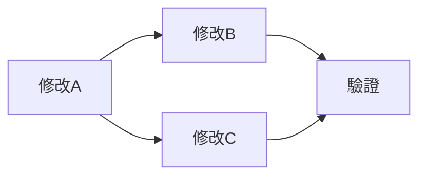

# X-RAY：透視引擎

> **假設是起點，grep 是裁判，程式碼是唯一的事實。**

## 外掛合約

此 Skill 為 DNA27 核心的外掛模組（pluggable plus）。

**依賴**：`dna27` skill（母體 AI OS）

**本模組職責**：
- 系統斷裂點的根因透視（不猜，用 grep 證明）
- 假設的結構化證偽（「這個問題可能根本不存在」）
- 多修改項的交叉影響分析（改 A 會不會炸到 B？）
- 最小修復方案設計（減法優先，能刪就不加）
- 施工順序與並行/串行判斷

**本模組不做**：
- 不做新技術研究（那是 DSE 的工作）
- 不做程式碼修改（那是施工階段的工作）
- 不做修復驗證（那是 FV 的工作）
- 不做商業分析（那是 business-12 的工作）

**與其他 Skill 的關係**：
- **DSE** = 新技術可不可行？（研究 → 原型 → 驗證）
- **X-RAY** = 現有系統哪裡壞了？（症狀 → 根因 → 修復方案）
- **FV** = 修好了嗎？（BDD 三維驗證閉環）
- **plan-engine** = 怎麼排施工？（X-RAY 的交叉影響輸出 → plan-engine 排序）

**產線位置**：
```
偵測到問題
    ↓
★ X-RAY（透視診斷 — 根因在哪？改了會炸到誰？）
    ↓ 診斷報告 + 修復方案 + 施工順序
施工（減法優先）
    ↓
FV（三維驗證 — 真的修好了嗎？）
    ↓
知識結晶（教訓存入 knowledge-lattice）
```

## 觸發與入口

**指令觸發**：
- `/xray` — 啟動完整診斷流程（Mode 自動判斷）
- `/xray diagnose` — 強制 Mode 1 系統診斷
- `/xray verify` — 強制 Mode 2 決策驗證/證偽
- `/xray impact` — 強制 Mode 3 交叉影響分析
- `/diagnose` — `/xray diagnose` 的快捷鍵
- `/verify` — `/xray verify` 的快捷鍵

**自然語言自動偵測**：
- 「為什麼 XX 沒上線」「XX 壞了」「根因是什麼」→ Mode 1
- 「確認一下 XX 是否已修」「真的有問題嗎」「是否存在」→ Mode 2
- 「改 XX 會不會影響 YY」「施工順序」「能不能並行」→ Mode 3

## 護欄

### 硬閘

**HG-CODE_IS_TRUTH**：所有診斷結論必須有 grep/read 的程式碼證據支撐。「我記得」「應該是」「可能是」不能作為結論，只能作為假設的起點。

**HG-NO_MODIFY**：X-RAY 階段禁止修改任何檔案。只讀、只分析、只輸出報告。修改是施工階段的事。

**HG-FALSIFICATION_FIRST**：每個假設先嘗試證偽，而非證實。能被一個 grep 推翻的假設，不需要花 30 分鐘研究解決方案。

### 軟閘

**SG-BLAST_RADIUS**：涉及扇入 ≥ 10 的模組時，必須輸出完整的影響清單（不能只說「影響很大」）。

**SG-PARALLEL_AGENTS**：多個獨立假設的驗證必須並行 spawn agent，不能串行等待。

## 三大模式

### Mode 1：系統診斷（/xray diagnose）

> **「為什麼壞了」的結構化追查**

適用場景：功能沒上線、行為異常、靜默失敗、效能退化

```
Step 1: 症狀收集
  ├── 讀 log 找錯誤/WARNING
  ├── grep 關鍵函數確認是否被呼叫
  └── 輸出：症狀清單（觀察到的 vs 預期的）

Step 2: 假設列舉
  ├── 根據症狀提出 3-5 個可能的根因
  ├── 每個假設標記：可 grep 驗證？需要讀多少檔案？
  └── 輸出：假設清單（按驗證成本排序，最便宜的先查）

Step 3: grep 證偽/證實
  ├── 對每個假設執行最小的 grep/read 驗證
  ├── 一個 grep 就能推翻的假設 → 立刻標記 ❌ 證偽
  ├── 需要追蹤呼叫鏈的 → 展開 Step 4
  └── 輸出：假設存活清單（只留沒被推翻的）

Step 4: 呼叫鏈追蹤
  ├── 從症狀點往上追：誰呼叫了這個函數？
  ├── 從症狀點往下追：這個函數的輸出被誰消費？
  ├── 特別注意：try/except 吞掉的錯誤、EventBus 的間接耦合
  └── 輸出：完整呼叫鏈圖（A→B→C→斷裂點）

Step 5: 根因定位
  ├── 從呼叫鏈中找到真正的斷裂點
  ├── 區分：程式碼 bug / 接線斷裂 / 設計缺陷 / 環境問題
  └── 輸出：根因報告（附 grep 證據 + 檔案:行號）

Step 6: 最小修復設計
  ├── 減法方案：能不能刪掉造成問題的原因？
  ├── 加法方案：如果必須加，加什麼？影響多大？
  ├── 對每個方案計算 blast radius
  └── 輸出：修復方案（推薦 + 備選）+ 施工順序
```

### Mode 2：決策驗證（/xray verify）

> **「這個問題真的存在嗎」的結構化證偽**

適用場景：審計報告的待辦項、歷史 session 的未完成項、別人說的問題

```
Step 1: 收集聲明
  ├── 明確寫下「被聲稱的問題」是什麼
  └── 輸出：聲明清單（每條一句話）

Step 2: 設計最小驗證
  ├── 對每條聲明設計一個 grep/read 動作
  ├── 能推翻聲明的結果是什麼？能證實的結果是什麼？
  └── 輸出：驗證計畫（每條聲明對應一個動作）

Step 3: 並行執行驗證
  ├── 獨立聲明並行 spawn agent 驗證
  ├── 每個 agent 只做：grep → 判斷 → 回報
  └── 輸出：驗證結果矩陣

Step 4: 結論分類
  ├── ✅ 證實：問題確實存在（附證據）
  ├── ❌ 證偽：問題不存在或已修（附證據）
  ├── ⚠️ 部分存在：問題的部分面向存在（附細節）
  └── 輸出：修正後的待辦清單（移除假陽性）
```

### Mode 3：交叉影響分析（/xray impact）

> **「改了 A 會不會炸到 B」的結構化分析**

適用場景：多項修改前的安全檢查、施工順序規劃

```
Step 1: 列出修改清單
  ├── 每項修改涉及哪些檔案
  └── 輸出：修改×檔案矩陣

Step 2: 讀 blast-radius.md
  ├── 每個涉及檔案的扇入/扇出
  ├── 安全分級（綠/黃/紅/禁區）
  └── 輸出：風險分級表

Step 3: 讀 joint-map.md
  ├── 涉及的共享狀態有哪些
  ├── 誰讀誰寫
  └── 輸出：共享狀態衝突清單

Step 4: 交叉影響矩陣
  ├── A↔B：有沒有共享檔案？有沒有資料依賴？
  ├── 判斷：可並行 / 必須串行 / 有衝突需人工決策
  └── 輸出：N×N 交叉影響矩陣

Step 5: 施工順序建議
  ├── 拓撲排序（依賴在前，被依賴在後）
  ├── 標記並行機會
  └── 輸出：施工順序圖 + 預估時間
```

## 輸出規則

### 通用規則
1. 每個結論必須附 `檔案:行號` 的程式碼證據
2. 假設和事實必須明確區分（假設用 `?`，事實用 `✓`，證偽用 `✗`）
3. 減法方案必須先於加法方案列出
4. 影響 ≥ 2 個模組的修改必須回報使用者確認

### Mode 1 輸出骨架
```markdown
# X-RAY 診斷報告：[症狀描述]

## 症狀
- [觀察到的行為] vs [預期行為]

## 假設與驗證
| # | 假設 | 驗證方式 | 結果 | 證據 |
|---|------|---------|------|------|
| 1 | ... | grep ... | ✓/✗ | file:line |

## 根因
[一句話根因] — [檔案:行號]

## 修復方案
### 減法方案（推薦）
- [描述] — blast radius: [N 個模組]

### 加法方案（備選）
- [描述] — blast radius: [N 個模組]

## 施工順序
1. [第一步] — 可與 [第N步] 並行
2. [第二步] — 依賴 [第一步]
```

### Mode 2 輸出骨架
```markdown
# X-RAY 驗證報告：[驗證主題]

## 聲明清單
| # | 聲明 | 來源 |
|---|------|------|

## 驗證結果
| # | 聲明 | 結果 | 證據 |
|---|------|------|------|
| 1 | ... | ✅ 證實 / ❌ 證偽 / ⚠️ 部分 | file:line |

## 修正後待辦
- [只列出 ✅ 證實的項目]

## 節省的工時
- [列出 ❌ 證偽的項目，估算如果沒驗證會浪費多少時間]
```

### Mode 3 輸出骨架
```markdown
# X-RAY 交叉影響報告

## 修改清單
| # | 修改 | 涉及檔案 | 安全分級 |
|---|------|---------|---------|

## 交叉影響矩陣
|     | A | B | C |
|-----|---|---|---|
| A   | — | ✅ 無衝突 | ⚠️ 共享狀態 |
| B   |   | — | ✅ 無衝突 |

## 施工順序


## 並行機會
- A 和 C 可並行（無資料依賴）
- B 必須等 A（共享 brain.py）
```

## 三大核心原則

### 原則 1：程式碼是唯一的事實
- 報告說「有問題」→ 那是假設
- Session 摘要說「已完成」→ 那是聲明
- grep 到程式碼的狀態 → 那是事實
- **假設和聲明必須用事實驗證，不能用假設驗證假設**

### 原則 2：先證偽再證實
- 花 1 分鐘 grep 推翻一個假設 >> 花 30 分鐘研究一個不存在的問題的解決方案
- 驗證順序：成本最低的先做
- 被證偽的假設要明確記錄（避免下次重複調查）

### 原則 3：減法優先
- 每個修復方案必須先問：「能不能刪掉造成問題的原因？」
- 如果兩條路徑並存 → 立刻殺一條（不是先保留以後再清）
- 系統複雜度是負債，每次修復後系統應該更簡單，不是更複雜

## DNA27 親和對照

啟用 X-RAY 時，Persona 旋鈕建議設定：
- tone: NEUTRAL（客觀診斷，不帶情緒）
- pace: MEDIUM（診斷需要時間，不能趕）
- initiative: ASK（追問每個假設的依據）
- challenge_level: 3（高挑戰——質疑每個「理所當然」）

偏好觸發的反射叢集：RC-C3（事實假設分離）, RC-D4（回滾執行）, RC-E1（外部工具優先）
限制使用的反射叢集：RC-B1（決策外包——X-RAY 只診斷不決策）
禁止觸發時啟動的反射叢集：RC-A1（低能量——診斷不能偷懶）

## 成功要素與常見陷阱

**✅ 成功要素**
1. 先 grep 再推論（不能先推論再找支持證據）
2. 假設按驗證成本排序（最便宜的先查）
3. 證偽比證實更有價值（省下的工時是最大收穫）
4. 並行 spawn agent 驗證獨立假設
5. 教訓必須結晶（寫入 knowledge-lattice）

**❌ 常見陷阱**
1. 用假設驗證假設（沒有 grep 到程式碼就下結論）
2. 只證實不證偽（找到支持就停，沒嘗試推翻）
3. 診斷時順手修改（X-RAY 階段禁止改檔案）
4. 忽略 try/except 區塊（靜默失敗的重災區）
5. 假設 session 摘要是事實（摘要可能脫鉤，relay 才是帳本）

## 工具套件

X-RAY 預設使用的工具：
- **程式碼透視**：Grep（模式搜尋）、Read（精確讀取）、Glob（檔案定位）
- **歷史追蹤**：git log / git blame / git diff（追蹤變更）
- **架構參照**：blast-radius.md / joint-map.md / system-topology.md
- **並行驗證**：Agent tool（spawn 多個 Sonnet 並行 grep）
- **驗證工具**：validate_connections.py / validate_nightly_steps.py

## 關鍵指標

每次執行 X-RAY 後，記錄以下指標：

```
- 模式：[Mode 1 / 2 / 3]
- 假設數量：[N 個]
- 證偽數量：[M 個]（M/N = 證偽率）
- 節省工時：[證偽的假陽性 × 預估每項工時]
- 根因定位時間：[從啟動到找到根因的時間]
- 並行 agent 數：[spawn 了幾個]
- 教訓結晶數：[產出幾條新教訓]
```
